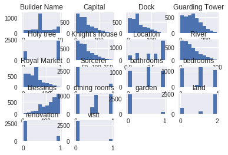
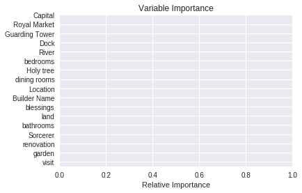
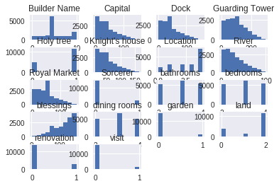
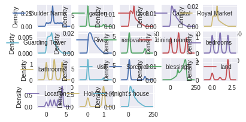
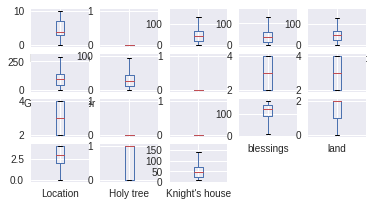
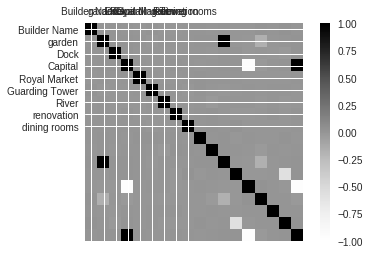

```python
%matplotlib inline
import pandas as pd
import numpy as np
import csv
from sklearn import linear_model
from sklearn import preprocessing
from sklearn.model_selection import train_test_split
from sklearn.metrics import r2_score
import datetime
import matplotlib.pyplot as plt
import seaborn as sns
with open('actual_train.csv') as csvfile:


	data = pd.read_csv(csvfile,delimiter=',')
	
	data['Builder Name'].fillna('Nan',inplace=True)
	lbl = preprocessing.LabelEncoder()
	lbl.fit(list(data['Builder Name'].values))
	data['Builder Name'] = lbl.transform(list(data['Builder Name'].values))

	data['garden'].fillna(0,inplace=True)
	data['garden'] = pd.DataFrame(data['garden'])
	data['garden'].fillna(0).rolling(window=2,min_periods=1).max()
	

	data['Dock'].fillna(data['Dock'].mean(),inplace=True)
	data['Capital'].fillna(data['Capital'].mean(),inplace=True)
	data['Royal Market'].fillna(data['Royal Market'].mean(),inplace=True)
	data['Guarding Tower'].fillna(data['Guarding Tower'].mean(),inplace=True)
	data['River'].fillna(data['River'].mean(),inplace=True)
	
	data['renovation'].fillna(0,inplace=True)
	data['renovation'] = pd.DataFrame(data['renovation'])
	data['renovation'].fillna(0).rolling(window=2,min_periods=1).max()
	
	
	data['dining rooms'].fillna(data['dining rooms'].mean(),inplace=True)
	data['bedrooms'].fillna(data['bedrooms'].mean(),inplace=True)
	data['bathrooms'].fillna(data['bathrooms'].mean(),inplace=True)
	
	data['visit'].fillna(0,inplace=True)
	data['visit'] = pd.DataFrame(data['visit'])
	data['visit'].fillna(0).rolling(window=2,min_periods=1).max()
	

	data['Sorcerer'].fillna(0,inplace=True)
	data['Sorcerer'] = pd.DataFrame(data['Sorcerer'])
	data['Sorcerer'].fillna(0).rolling(window=2,min_periods=1).max()
	
	data['blessings'].fillna(data['blessings'].mean(),inplace=True)
	
	data['land'].fillna(0,inplace=True)
	lbl = preprocessing.LabelEncoder()
	lbl.fit(list(data['land'].values))
	data['land'] = lbl.transform(list(data['land'].values))
	
	data['Location'].fillna(0,inplace=True)
	lbl = preprocessing.LabelEncoder()
	lbl.fit(list(data['Location'].values))
	data['Location'] = lbl.transform(list(data['Location'].values))
	
	data['Holy tree'].fillna(0,inplace=True)
	data['Holy tree'] = pd.DataFrame(data['Holy tree'])
	data['Holy tree'].fillna(0).rolling(window=2,min_periods=1).max()
	
	data['Knight\'s house'].fillna(data['Knight\'s house'].mean(),inplace=True)
	y = data['Golden Grains']
	del data['Golden Grains']
	del data['House ID'] 
	del data['Date Built']
	del data['Date Priced']
	X = data
	print(X)
```

           Builder Name  garden        Dock     Capital  Royal Market  \
    0                 0     0.0  138.600639    0.256239     69.486467   
    1                 0     0.0   10.998322  122.930753     63.794375   
    2                 0     0.0   52.819705   80.970959     96.656914   
    3                 0     0.0   82.283966    4.331436     29.043012   
    4                 0     0.0   34.524141   42.674021      6.740951   
    5                 0     0.0   38.877415   25.065928     48.715817   
    6                 0     0.0   35.988844    4.570255     67.579542   
    7                 0     0.0   83.914728  107.184545     57.067604   
    8                 0     0.0   64.288283  101.610694     48.715817   
    9                 0     0.0   59.504656   29.541134      3.366960   
    10                0     0.0   74.890453   17.524012     48.715817   
    11                0     0.0    1.624838   55.126870     48.715817   
    12                0     0.0   13.140060   23.920629      7.363083   
    13                0     1.0   25.738221   67.262718     31.834800   
    14                0     0.0   86.072564   85.923206     85.563521   
    15                0     0.0   51.245386   22.260774      9.938782   
    16                0     0.0   34.410733   16.638938     48.715817   
    17                0     1.0   67.171839   73.733494     22.279648   
    18                0     0.0   61.212460   58.817801      5.643314   
    19                0     0.0    8.423696    3.031959     31.432316   
    20                0     0.0   46.305520   26.820090     34.978795   
    21                0     0.0   57.714600    6.002568     47.348837   
    22                0     0.0   15.523291  153.360600     32.174217   
    23                0     0.0   46.305520    8.760628    124.305272   
    24                0     0.0   42.570615    5.490400     48.715817   
    25                0     0.0   24.684360    9.161377     48.715817   
    26                0     0.0   71.753065   39.952939     48.715817   
    27                0     0.0   22.060342   16.090119      8.102772   
    28                0     0.0   19.373454  105.408838    112.774373   
    29                0     0.0   72.979347   68.347073     66.602162   
    ...             ...     ...         ...         ...           ...   
    16470             3     0.0   30.657471    2.536759     48.715817   
    16471             3     0.0   99.469401   16.932893     17.411612   
    16472             3     0.0   17.470493   29.472796     68.684736   
    16473             3     0.0   36.962348   12.206898     32.190630   
    16474             3     0.0   42.282734   18.770951     14.550977   
    16475             3     0.0  139.063956    7.061776     41.158186   
    16476             3     0.0   74.692066   38.905789     11.267211   
    16477             3     0.0   10.935979   50.812362     19.197435   
    16478             3     1.0   17.590463   19.186257     39.903031   
    16479             3     0.0   43.917540   57.335988     14.446724   
    16480             3     0.0   33.172609   14.177629     32.721000   
    16481             3     0.0   15.042323   20.684047     13.082454   
    16482             3     0.0    9.998108   36.098841     40.844168   
    16483             3     0.0   24.469254   42.674021     12.792692   
    16484             3     0.0   46.305520    9.414936      0.956620   
    16485             3     1.0  120.419971   17.680212     48.715817   
    16486             3     0.0   46.305520    7.271705     48.715817   
    16487             3     0.0   46.305520   16.231699     27.426882   
    16488             3     0.0   23.339162   31.533312     44.736495   
    16489             3     0.0   86.360066   22.856438      8.228416   
    16490             3     0.0   26.814015   15.915382     82.475048   
    16491             3     0.0    7.323182   11.206185    118.613881   
    16492             3     0.0   92.556214   74.141476      8.017215   
    16493             3     0.0    7.697682   42.674021     18.341251   
    16494             3     0.0   35.647763   57.747171     49.035821   
    16495             3     0.0  102.037909   23.606728     23.774670   
    16496             3     0.0   65.207136    7.969132     68.608155   
    16497             3     0.0   21.020459   51.663832     48.715817   
    16498             3     0.0   46.305520   45.507866     48.715817   
    16499             3     1.0   70.714679   93.758943     91.307022   
    
           Guarding Tower      River  renovation  dining rooms  bedrooms  \
    0           14.394903  63.109038         0.0      3.000000  4.000000   
    1           53.019891  17.045949         0.0      4.000000  3.000000   
    2           70.965631   6.548119         0.0      2.000000  2.000000   
    3          119.126593  24.298255         0.0      3.001615  2.000000   
    4          222.341302   1.821655         0.0      4.000000  2.000000   
    5           76.196189   1.257721         0.0      3.000000  3.000000   
    6          157.877738  15.756025         0.0      2.000000  3.000000   
    7          147.898157  55.592034         0.0      2.000000  4.000000   
    8          204.669501  60.009117         0.0      2.000000  4.000000   
    9           63.397907  21.391704         0.0      4.000000  3.000000   
    10          86.880636  77.993602         0.0      3.001615  4.000000   
    11         163.885000  16.102894         1.0      3.001615  4.000000   
    12         154.780872  15.867466         0.0      3.000000  4.000000   
    13          84.042989   7.106701         0.0      4.000000  3.000000   
    14         146.862456  12.638273         0.0      2.000000  2.000000   
    15          96.415385   5.789836         0.0      3.001615  3.001514   
    16          50.512115  15.009420         1.0      2.000000  4.000000   
    17         104.567561  43.619874         0.0      3.000000  2.000000   
    18         160.459915  41.915869         0.0      2.000000  4.000000   
    19          10.970801  21.169758         1.0      2.000000  3.000000   
    20          91.361455  41.862843         0.0      3.000000  2.000000   
    21          32.106155   2.870670         0.0      4.000000  3.000000   
    22         101.110421  33.493852         0.0      3.001615  4.000000   
    23          30.021297  15.976977         1.0      3.000000  2.000000   
    24         129.093289  69.237309         0.0      2.000000  2.000000   
    25          81.939551  56.170727         0.0      2.000000  3.000000   
    26          18.206663   4.047991         0.0      4.000000  2.000000   
    27         146.852007   4.032337         0.0      2.000000  4.000000   
    28         111.202407  18.147350         1.0      3.000000  3.000000   
    29          21.463548  14.622076         0.0      4.000000  2.000000   
    ...               ...        ...         ...           ...       ...   
    16470       84.827574   3.143070         0.0      4.000000  2.000000   
    16471       22.852787   9.684995         0.0      2.000000  4.000000   
    16472      110.844621  25.875609         0.0      4.000000  2.000000   
    16473        6.813486  81.591443         0.0      3.000000  2.000000   
    16474      241.366480   2.994704         0.0      4.000000  3.000000   
    16475      152.468960   2.720305         0.0      2.000000  3.000000   
    16476       78.676374  60.947632         1.0      4.000000  4.000000   
    16477      111.811551  13.884591         0.0      2.000000  2.000000   
    16478       13.241659  30.948410         0.0      2.000000  2.000000   
    16479       16.863760  30.182791         0.0      3.000000  2.000000   
    16480      119.591150  25.535113         0.0      3.000000  2.000000   
    16481       22.923540  29.119976         0.0      2.000000  3.000000   
    16482       80.601922  25.281236         0.0      3.001615  3.000000   
    16483       65.223971   9.178285         0.0      4.000000  3.000000   
    16484       78.523320  19.159510         0.0      3.000000  3.000000   
    16485      171.538744  14.527558         0.0      2.000000  4.000000   
    16486       43.719049  39.013951         0.0      3.000000  2.000000   
    16487       54.733466  14.883636         0.0      2.000000  4.000000   
    16488      137.082743   5.664100         0.0      2.000000  3.000000   
    16489        2.401613  24.964133         0.0      4.000000  2.000000   
    16490      145.564202  27.257896         1.0      2.000000  2.000000   
    16491       93.716156  20.647871         0.0      3.001615  3.000000   
    16492       55.155709   3.834696         0.0      2.000000  4.000000   
    16493       11.298630  52.983671         0.0      4.000000  4.000000   
    16494       89.130396  16.280123         0.0      4.000000  3.000000   
    16495       38.123582  14.412248         0.0      3.000000  3.000000   
    16496      129.336333  76.952029         1.0      3.000000  3.000000   
    16497      167.737835   8.735080         0.0      3.001615  4.000000   
    16498       44.626784  30.435220         0.0      3.001615  2.000000   
    16499      200.095127  26.839645         0.0      4.000000  4.000000   
    
           bathrooms  visit  Sorcerer  blessings  land  Location  Holy tree  \
    0       3.007209      0       0.0        160     2         2        1.0   
    1       3.000000      0       0.0         37     0         4        1.0   
    2       3.000000      0       0.0         79     2         1        1.0   
    3       3.000000      0       1.0        156     2         1        0.0   
    4       4.000000      0       0.0         74     2         4        1.0   
    5       3.000000      0       0.0        135     0         3        0.0   
    6       4.000000      0       0.0        155     2         4        1.0   
    7       4.000000      0       1.0         53     2         4        0.0   
    8       3.000000      0       0.0         58     2         4        1.0   
    9       3.000000      0       0.0        130     0         2        1.0   
    10      3.000000      0       0.0        142     2         2        1.0   
    11      4.000000      0       1.0        105     2         2        0.0   
    12      2.000000      0       0.0        136     2         2        1.0   
    13      4.000000      1       0.0         93     1         2        1.0   
    14      3.000000      0       1.0         74     2         1        0.0   
    15      3.000000      0       0.0        138     0         0        0.0   
    16      4.000000      0       1.0        143     2         4        0.0   
    17      3.000000      1       0.0         86     1         4        0.0   
    18      2.000000      0       0.0        101     2         4        1.0   
    19      2.000000      0       0.0        157     2         4        1.0   
    20      4.000000      0       0.0        133     2         4        0.0   
    21      3.007209      0       0.0        154     2         4        1.0   
    22      4.000000      0       1.0          7     0         2        1.0   
    23      3.007209      0       0.0        151     2         1        1.0   
    24      3.000000      0       0.0        155     2         3        1.0   
    25      4.000000      0       0.0        151     2         4        1.0   
    26      2.000000      0       0.0        120     2         4        1.0   
    27      2.000000      0       0.0        144     2         0        1.0   
    28      2.000000      0       0.0         55     2         4        1.0   
    29      4.000000      0       0.0         92     2         0        1.0   
    ...          ...    ...       ...        ...   ...       ...        ...   
    16470   2.000000      0       0.0        157     2         4        1.0   
    16471   3.000000      0       0.0        143     0         3        0.0   
    16472   3.000000      0       0.0        131     2         3        1.0   
    16473   4.000000      0       0.0        148     2         4        1.0   
    16474   4.000000      0       0.0        141     2         4        1.0   
    16475   2.000000      0       0.0        153     2         2        1.0   
    16476   2.000000      0       0.0        121     2         4        1.0   
    16477   4.000000      0       0.0        109     2         4        1.0   
    16478   2.000000      1       1.0        141     1         4        0.0   
    16479   2.000000      0       0.0        103     0         4        1.0   
    16480   4.000000      0       0.0        146     2         0        1.0   
    16481   3.007209      0       0.0        139     2         1        1.0   
    16482   3.000000      0       0.0        124     2         4        1.0   
    16483   2.000000      0       0.0         74     2         1        1.0   
    16484   3.000000      0       0.0        151     2         0        1.0   
    16485   3.000000      1       0.0        142     1         4        1.0   
    16486   3.000000      0       0.0        153     2         3        1.0   
    16487   4.000000      0       1.0        144     2         4        0.0   
    16488   3.000000      0       0.0        128     2         3        1.0   
    16489   2.000000      0       0.0        137     2         4        1.0   
    16490   4.000000      0       0.0        144     2         4        1.0   
    16491   4.000000      0       0.0        149     0         2        1.0   
    16492   3.000000      0       0.0         86     2         4        0.0   
    16493   3.000000      0       0.0         74     2         3        1.0   
    16494   4.000000      0       0.0        102     2         4        1.0   
    16495   2.000000      0       0.0        136     2         0        1.0   
    16496   4.000000      0       0.0        152     2         4        1.0   
    16497   4.000000      0       0.0        108     2         2        1.0   
    16498   3.007209      0       0.0        114     0         2        1.0   
    16499   3.000000      1       0.0         66     1         4        0.0   
    
           Knight's house  
    0           10.505662  
    1          132.934312  
    2           91.425357  
    3           14.695102  
    4           53.169633  
    5           35.568437  
    6           15.068711  
    7          117.410316  
    8          112.494554  
    9           40.454345  
    10          27.655990  
    11          65.487434  
    12          34.604391  
    13          77.441446  
    14          96.737140  
    15          33.157025  
    16          27.320449  
    17          84.146593  
    18          69.088692  
    19          13.114153  
    20          37.442226  
    21          16.567206  
    22         163.658437  
    23          19.113862  
    24          16.031784  
    25          20.134738  
    26          50.871204  
    27          26.440610  
    28         116.378343  
    29          78.594989  
    ...               ...  
    16470       12.738346  
    16471       27.324746  
    16472       39.474687  
    16473       22.612306  
    16474       29.093670  
    16475       17.240812  
    16476       49.341549  
    16477       61.214650  
    16478       30.003061  
    16479       68.127007  
    16480       24.760522  
    16481       31.003452  
    16482       46.583222  
    16483       53.169633  
    16484       20.315303  
    16485       28.318204  
    16486       17.497838  
    16487       26.610454  
    16488       41.790338  
    16489       33.172215  
    16490       26.907068  
    16491       21.491293  
    16492       84.919473  
    16493       53.169633  
    16494       68.259801  
    16495       34.379008  
    16496       18.340307  
    16497       62.562426  
    16498       55.563000  
    16499      104.479135  
    
    [16500 rows x 18 columns]


```python
with open('test.csv') as TestData:
		data1 = pd.read_csv(TestData,delimiter=',')
		
		data1['Builder Name'].fillna('Nan',inplace=True)
		lbl = preprocessing.LabelEncoder()
		lbl.fit(list(data1['Builder Name'].values))
		data1['Builder Name'] = lbl.transform(list(data1['Builder Name'].values))
		
		data1['garden'].fillna(0,inplace=True)
		data1['garden'] = pd.DataFrame(data1['garden'])
		data1['garden'].fillna(0).rolling(window=2,min_periods=1).max()
		
		data1['Dock'].fillna(data1['Dock'].mean(),inplace=True)
		data1['Capital'].fillna(data1['Capital'].mean(),inplace=True)
		data1['Royal Market'].fillna(data1['Royal Market'].mean(),inplace=True)
		data1['Guarding Tower'].fillna(data1['Guarding Tower'].mean(),inplace=True)
		data1['River'].fillna(data1['River'].mean(),inplace=True)
		
		data1['renovation'].fillna(0,inplace=True)
		data1['renovation'] = pd.DataFrame(data1['renovation'])
		data1['renovation'].fillna(0).rolling(window=2,min_periods=1).max()
		
		data1['dining rooms'].fillna(data1['dining rooms'].mean(),inplace=True)
		data1['bedrooms'].fillna(data1['bedrooms'].mean(),inplace=True)
		data1['bathrooms'].fillna(data1['bathrooms'].mean(),inplace=True)
		
		data1['visit'].fillna(0,inplace=True)
		data1['visit'] = pd.DataFrame(data1['visit'])
		data1['visit'].fillna(0).rolling(window=2,min_periods=1).max()
		
		data1['Sorcerer'].fillna(0,inplace=True)
		data1['Sorcerer'] = pd.DataFrame(data1['Sorcerer'])
		data1['Sorcerer'].fillna(0).rolling(window=2,min_periods=1).max()
		
		data1['blessings'].fillna(data1['blessings'].mean(),inplace=True)
		
		data1['land'].fillna(0,inplace=True)
		lbl = preprocessing.LabelEncoder()
		lbl.fit(list(data1['land'].values))
		data1['land'] = lbl.transform(list(data1['land'].values))
	
		data1['Location'].fillna(0,inplace=True)
		lbl = preprocessing.LabelEncoder()
		lbl.fit(list(data1['Location'].values))
		data1['Location'] = lbl.transform(list(data1['Location'].values))
	
		data1['Holy tree'].fillna(0,inplace=True)
		data1['Holy tree'] = pd.DataFrame(data1['Holy tree'])
		data1['Holy tree'].fillna(0).rolling(window=2,min_periods=1).max()
		data1['Knight\'s house'].fillna(data1['Knight\'s house'].mean(),inplace=True)
		yx = data1['House ID']
		del data1['House ID'] 
		del data1['Date Built']
		del data1['Date Priced']
```


```python
print(data1)
```

          Builder Name  garden        Dock     Capital  Royal Market  \
    0                0     0.0   13.943795   66.361720     17.472071   
    1                0     0.0   54.614026   69.493909     51.702360   
    2                0     0.0   46.669293   53.516658     69.358851   
    3                0     0.0   62.951923    1.110726     27.481924   
    4                0     0.0   46.669293   29.990557     83.585774   
    5                0     1.0   15.116091  126.132263     55.020815   
    6                0     0.0   39.959253    6.968619     48.232385   
    7                0     0.0   44.537313   17.350129     10.428286   
    8                0     0.0   77.600624   70.545213     22.738725   
    9                0     0.0  107.965919   13.062380     82.970956   
    10               0     0.0   35.589152   33.614077     33.267484   
    11               0     0.0   67.708419  109.273895     19.703147   
    12               0     0.0   83.170564   49.948263    155.248471   
    13               0     0.0   20.492616   75.405939     45.445107   
    14               0     0.0   43.259796    9.267577     65.619034   
    15               0     0.0   12.346990   45.700470      3.881484   
    16               0     0.0   98.894729   51.232823     48.157133   
    17               0     0.0   54.841726   86.216361      5.647999   
    18               0     0.0   46.669293   42.779047     18.650792   
    19               0     0.0   46.669293   15.190643     10.166600   
    20               0     0.0   31.272548   20.916768     80.061170   
    21               0     0.0  152.117187   35.748797     75.415612   
    22               0     0.0  129.815947   42.779047    144.017679   
    23               0     0.0   75.863169    5.076165      7.377153   
    24               0     0.0   59.366352    2.243687     14.258143   
    25               0     1.0   76.402926   33.228256     35.703632   
    26               0     0.0    2.421057   42.779047     52.285570   
    27               0     0.0  111.101335   47.294944     89.027970   
    28               0     0.0    2.809377   11.946006     68.441446   
    29               0     0.0   47.421643   27.514556     44.260997   
    ...            ...     ...         ...         ...           ...   
    3470             3     0.0   43.988128    7.859531     21.864451   
    3471             3     0.0  124.277387   26.585604     48.157133   
    3472             3     0.0   53.390747   63.005148     48.157133   
    3473             3     0.0   46.669293   87.177020      3.268224   
    3474             3     0.0   26.054461   47.626358     66.965467   
    3475             3     0.0   36.764007   42.779047    100.310516   
    3476             3     0.0    8.374054   77.933790     48.157133   
    3477             3     0.0   37.489755   39.470206     28.780797   
    3478             3     0.0  123.529964   99.109084     35.156641   
    3479             3     0.0   37.350035   34.700940     40.661395   
    3480             3     0.0    1.439561   65.764795    117.013179   
    3481             3     0.0    9.486588   66.890488     48.157133   
    3482             3     0.0  101.479557   28.431351     10.801679   
    3483             3     0.0   45.465833   43.115014     13.857624   
    3484             3     0.0   99.581267   42.779047     48.157133   
    3485             3     0.0   65.987991    3.201807     60.092075   
    3486             3     0.0   46.669293   34.494142      7.060097   
    3487             3     0.0   46.669293   44.508545     71.911093   
    3488             3     0.0   38.382462   99.189312     69.412063   
    3489             3     0.0    5.865003   42.779047     53.304314   
    3490             3     1.0   39.584799   17.051358      3.362392   
    3491             3     0.0   46.070323   48.816069     35.953944   
    3492             3     0.0   13.607102    4.520356     48.157133   
    3493             3     0.0   26.845788   22.562546     81.707208   
    3494             3     0.0  130.562738   37.883623     35.477906   
    3495             3     1.0   46.669293   39.517919      9.233525   
    3496             3     0.0   23.372989   30.191925     25.272276   
    3497             3     0.0   50.918290   52.720016      2.679160   
    3498             3     0.0   14.498331   36.449596    113.572548   
    3499             3     0.0   66.418102  112.655979     48.157133   
    
          Guarding Tower      River  renovation  dining rooms  bedrooms  \
    0          54.192768  78.604543         0.0      3.000000  2.000000   
    1         175.727267   4.314068         1.0      2.000000  2.000000   
    2         205.988813  35.269996         1.0      3.000000  2.000000   
    3          85.758040  89.197021         0.0      2.000000  2.000000   
    4         100.917690  44.158432         1.0      3.000000  2.000000   
    5          55.368695  42.951367         1.0      4.000000  2.000000   
    6         140.178982  48.478232         0.0      4.000000  3.000000   
    7         139.181586  31.850767         0.0      2.998729  4.000000   
    8         188.608021  31.062438         0.0      2.000000  2.000000   
    9         144.120508   2.838920         1.0      3.000000  3.000000   
    10         77.138577   6.437510         0.0      4.000000  2.000000   
    11         98.988958  47.638410         0.0      3.000000  4.000000   
    12          4.634372  26.998486         0.0      4.000000  4.000000   
    13         62.061990  35.165146         0.0      2.998729  2.000000   
    14         48.402445  30.035965         0.0      4.000000  2.000000   
    15        109.145710  84.062185         0.0      4.000000  2.000000   
    16        131.236542  62.936165         1.0      2.000000  2.968583   
    17         91.691521   1.857334         0.0      3.000000  2.000000   
    18        271.687479  18.938849         0.0      4.000000  2.000000   
    19        137.252671   5.957790         0.0      3.000000  3.000000   
    20        156.189825  20.969554         0.0      4.000000  3.000000   
    21        191.380468  51.410015         0.0      4.000000  3.000000   
    22        163.034064   8.660634         0.0      4.000000  2.000000   
    23        115.984664  43.880010         0.0      2.000000  4.000000   
    24         25.518932   6.420145         0.0      4.000000  4.000000   
    25         95.615451  20.757493         0.0      2.998729  4.000000   
    26        100.917690   5.619151         0.0      2.998729  4.000000   
    27         45.276057   5.342889         0.0      3.000000  4.000000   
    28        129.853742  20.869150         0.0      2.000000  3.000000   
    29         12.931321   0.781194         0.0      2.998729  3.000000   
    ...              ...        ...         ...           ...       ...   
    3470       70.169710   8.716909         0.0      4.000000  2.000000   
    3471       23.141135  41.909185         0.0      4.000000  3.000000   
    3472       96.691951   5.611173         0.0      4.000000  2.000000   
    3473       53.992178   8.036161         0.0      2.000000  2.000000   
    3474      139.241002   5.911792         0.0      2.998729  4.000000   
    3475       13.262089  22.809689         1.0      2.000000  2.000000   
    3476      215.786697  46.236075         0.0      3.000000  3.000000   
    3477       96.334130  40.832872         0.0      2.000000  2.000000   
    3478       91.234207  11.236321         1.0      4.000000  4.000000   
    3479      101.245153  47.070689         1.0      4.000000  3.000000   
    3480       76.933776  14.561020         1.0      2.998729  4.000000   
    3481      224.939349  62.399351         0.0      4.000000  3.000000   
    3482       49.959949  26.927539         0.0      3.000000  2.000000   
    3483      141.113841  72.935126         0.0      2.998729  3.000000   
    3484      181.437385  56.129210         0.0      2.000000  4.000000   
    3485       40.708045  42.848439         0.0      3.000000  4.000000   
    3486       38.394712  49.137866         0.0      3.000000  4.000000   
    3487       91.017345  71.772719         0.0      3.000000  3.000000   
    3488       99.356326   0.693121         0.0      3.000000  3.000000   
    3489       98.579682  26.439705         0.0      2.000000  3.000000   
    3490      131.398876  20.994317         0.0      4.000000  4.000000   
    3491      112.456075  51.427943         0.0      2.000000  4.000000   
    3492       10.912678   4.941603         0.0      2.000000  2.000000   
    3493      190.624713  41.121714         1.0      3.000000  4.000000   
    3494       63.686645  48.193589         0.0      2.000000  2.000000   
    3495      144.212785  74.767604         0.0      2.000000  4.000000   
    3496      218.128276   0.878784         0.0      3.000000  4.000000   
    3497      138.006993  42.989559         0.0      3.000000  3.000000   
    3498       43.036401  54.055006         0.0      2.000000  2.000000   
    3499      100.917690  19.490151         1.0      2.000000  2.000000   
    
          bathrooms  visit  Sorcerer  blessings  land  Location  Holy tree  \
    0      4.000000    0.0       0.0         94     2         0        1.0   
    1      2.000000    0.0       1.0         91     2         4        0.0   
    2      3.000000    0.0       1.0        106     2         0        0.0   
    3      4.000000    0.0       0.0        159     2         3        1.0   
    4      2.000000    0.0       0.0        130     2         2        1.0   
    5      2.000000    1.0       0.0         34     1         4        0.0   
    6      4.000000    0.0       0.0        153     2         3        1.0   
    7      4.000000    0.0       0.0        143     2         4        0.0   
    8      4.000000    0.0       1.0         89     0         4        0.0   
    9      2.000000    0.0       0.0        147     2         3        0.0   
    10     2.000000    0.0       1.0        126     2         4        0.0   
    11     2.000000    0.0       1.0         51     2         2        0.0   
    12     4.000000    0.0       0.0        110     2         3        1.0   
    13     3.000000    0.0       0.0         85     2         0        1.0   
    14     3.000000    0.0       0.0        151     2         4        1.0   
    15     4.000000    0.0       0.0        114     2         2        1.0   
    16     3.002426    0.0       0.0        109     2         4        1.0   
    17     4.000000    0.0       0.0         74     2         4        1.0   
    18     2.000000    0.0       1.0         74     0         4        0.0   
    19     4.000000    0.0       0.0        145     2         4        1.0   
    20     3.000000    0.0       0.0        139     2         4        1.0   
    21     2.000000    0.0       0.0        124     2         2        1.0   
    22     4.000000    0.0       0.0         74     0         2        1.0   
    23     4.000000    0.0       0.0        155     0         4        0.0   
    24     3.000000    0.0       0.0        158     2         0        1.0   
    25     4.000000    1.0       0.0        127     1         4        0.0   
    26     4.000000    0.0       0.0         74     2         4        1.0   
    27     3.000000    0.0       0.0        113     2         4        1.0   
    28     3.002426    0.0       0.0        148     2         4        1.0   
    29     4.000000    0.0       0.0        132     0         3        0.0   
    ...         ...    ...       ...        ...   ...       ...        ...   
    3470   3.000000    0.0       0.0        152     0         4        0.0   
    3471   2.000000    0.0       0.0        133     2         1        1.0   
    3472   4.000000    0.0       1.0         97     2         4        0.0   
    3473   4.000000    0.0       0.0         73     0         4        1.0   
    3474   2.000000    0.0       1.0        112     2         0        0.0   
    3475   3.000000    0.0       0.0         74     2         1        1.0   
    3476   3.000000    0.0       1.0         82     2         4        0.0   
    3477   3.000000    0.0       1.0        121     2         4        0.0   
    3478   3.000000    0.0       0.0         61     2         1        1.0   
    3479   4.000000    0.0       0.0        125     2         1        0.0   
    3480   4.000000    0.0       0.0         94     2         4        0.0   
    3481   4.000000    0.0       0.0         93     2         1        1.0   
    3482   3.000000    0.0       0.0        132     2         4        1.0   
    3483   4.000000    0.0       0.0        117     2         3        0.0   
    3484   3.000000    0.0       0.0         74     0         3        1.0   
    3485   2.000000    0.0       0.0        157     0         4        1.0   
    3486   2.000000    0.0       0.0        126     2         2        1.0   
    3487   2.000000    0.0       0.0        115     0         2        1.0   
    3488   2.000000    0.0       0.0         61     0         3        1.0   
    3489   4.000000    0.0       0.0         74     2         4        1.0   
    3490   2.000000    1.0       0.0        143     1         1        1.0   
    3491   4.000000    0.0       0.0        111     2         4        1.0   
    3492   4.000000    0.0       0.0        155     2         4        1.0   
    3493   2.000000    0.0       0.0        137     2         4        1.0   
    3494   2.000000    0.0       1.0        122     2         4        0.0   
    3495   4.000000    1.0       0.0        120     1         4        0.0   
    3496   2.000000    0.0       0.0        130     0         1        1.0   
    3497   4.000000    0.0       0.0        107     2         0        0.0   
    3498   4.000000    0.0       0.0        124     2         4        1.0   
    3499   3.000000    0.0       0.0         47     2         1        1.0   
    
          Knight's house  
    0          76.513349  
    1          79.935506  
    2          64.482333  
    3          11.346422  
    4          40.817066  
    5         136.520034  
    6          17.291333  
    7          28.249369  
    8          81.093436  
    9          23.136797  
    10         44.096952  
    11        120.003175  
    12         59.983593  
    13         85.538348  
    14         19.788028  
    15         56.054739  
    16         61.681760  
    17         96.726064  
    18         53.292374  
    19         25.427390  
    20         31.784357  
    21         45.753009  
    22         53.292374  
    23         15.429165  
    24         13.147035  
    25         43.435281  
    26         53.292374  
    27         58.241293  
    28         22.620432  
    29         37.850317  
    ...              ...  
    3470       18.341070  
    3471       37.358384  
    3472       73.579822  
    3473       97.838575  
    3474       58.549449  
    3475       53.292374  
    3476       88.542992  
    3477       50.336458  
    3478      109.905160  
    3479       45.347744  
    3480       76.430194  
    3481       77.218555  
    3482       39.099994  
    3483       53.405039  
    3484       53.292374  
    3485       14.195460  
    3486       45.068376  
    3487       54.530561  
    3488      109.454335  
    3489       53.292374  
    3490       27.601398  
    3491       59.509351  
    3492       15.082839  
    3493       32.706382  
    3494       48.734068  
    3495       49.841786  
    3496       40.641315  
    3497       63.569968  
    3498       47.215079  
    3499      122.692757  
    
    [3500 rows x 18 columns]


```python
from sklearn.ensemble import RandomForestRegressor
clf=RandomForestRegressor(n_estimators=1000,random_state=15)
clf.fit(X,y)
predict1=clf.predict(data1)
print(predict1)


```

    [ 1215892.503  1140425.895  1152782.956 ...,  1233852.772  1264627.636
       983228.901]


```python
		with open('result.csv',"w") as f:
			writer = csv.writer(f)
			ps = ['House ID','Golden Grains']
			writer.writerow(ps)
			
			for x,vc  in  zip(yx,predict1):
				writer.writerow([x,vc])
```


```python
"""
from sklearn.svm import SVR
j=0.1
while j< 0.6:
    i=0.5
    while i < 2.0:
        print("loop")
        clf1=SVR(C=i,epsilon=j,kernel='linear')
        clf1.fit(X,y)
        pred=clf1.predict(data1)
        print(pred)
        i=i+0.1
    j=j+0.1
df1=pd.read_csv('/home/harsha4148/Downloads/Housing Prices/merged.csv')
for row1 in df1['Golden Grains']:
		try:
			df1['Golden Grains'].replace(row1,float(row1))
		except:
			df1['Golden Grains'].replace(row1,float())
frame=df1['Golden Grains']
from sklearn.metrics import r2_score
#print(r2_score(df1,pred))
"""
```


    '\nfrom sklearn.svm import SVR\nj=0.1\nwhile j< 0.6:\n    i=0.5\n    while i < 2.0:\n        print("loop")\n        clf1=SVR(C=i,epsilon=j,kernel=\'linear\')\n        clf1.fit(X,y)\n        pred=clf1.predict(data1)\n        print(pred)\n        i=i+0.1\n    j=j+0.1\ndf1=pd.read_csv(\'/home/harsha4148/Downloads/Housing Prices/merged.csv\')\nfor row1 in df1[\'Golden Grains\']:\n\t\ttry:\n\t\t\tdf1[\'Golden Grains\'].replace(row1,float(row1))\n\t\texcept:\n\t\t\tdf1[\'Golden Grains\'].replace(row1,float())\nframe=df1[\'Golden Grains\']\nfrom sklearn.metrics import r2_score\n#print(r2_score(df1,pred))\n'


```python

#from xgboost.sklearn import XGBRegressor
#reg5 = XGBRegressor(max_depth=8,min_child_weight=1,n_estimators=301,learning_rate=0.1)
#reg5.fit(X ,y)
#prediction1 = reg5.predict(data1)
#print(prediction1)        
```


```python
print("using rfr")
from pandas.tools.plotting import scatter_matrix
from sklearn.ensemble import RandomForestRegressor
rfc = RandomForestRegressor(n_estimators=500)
rfc.fit(X,y)
names=data1.columns.values
print("Features sorted by their score:")
print(sorted(zip(map(lambda x: round(x, 4), rfc.feature_importances_), names), reverse=True))
importance = rfc.feature_importances_
sorted_importances = np.argsort(importance)
padding = np.arange(len(names)-1) + 0.5
#plt.barh(padding, importance[sorted_importances], align='center')
print("Histogram of test data")
data1.hist()
plt.show()
plt.yticks(padding, names[sorted_importances])
plt.xlabel("Relative Importance")
plt.title("Variable Importance")
print("histogram of train data")
data.hist()
plt.show()
print("density plot:")
data.plot(kind='density', subplots=True, layout=(5,5), sharex=False)
plt.show()
print("box plot")
data.plot(kind='box', subplots=True, layout=(5,5), sharex=False, sharey=False)
plt.show()
print("correlation :")
correlations = data.corr()
fig = plt.figure()
ax = fig.add_subplot(111)
cax = ax.matshow(correlations, vmin=-1, vmax=1)
fig.colorbar(cax)
ticks = np.arange(0,9,1)
ax.set_xticks(ticks)
ax.set_yticks(ticks)
ax.set_xticklabels(names)
ax.set_yticklabels(names)
plt.show()
print("Scatter plot")
scatter_matrix(data)
plt.show()
```

    using rfr
    Features sorted by their score:
    [(0.38840000000000002, "Knight's house"), (0.38400000000000001, 'Capital'), (0.050999999999999997, 'Royal Market'), (0.031300000000000001, 'Guarding Tower'), (0.031199999999999999, 'Dock'), (0.0298, 'River'), (0.0189, 'bedrooms'), (0.0161, 'Holy tree'), (0.0137, 'dining rooms'), (0.0115, 'Location'), (0.0071999999999999998, 'Builder Name'), (0.0045999999999999999, 'blessings'), (0.0044999999999999997, 'land'), (0.0037000000000000002, 'bathrooms'), (0.0015, 'Sorcerer'), (0.0011999999999999999, 'renovation'), (0.00080000000000000004, 'garden'), (0.00069999999999999999, 'visit')]




















    ---------------------------------------------------------------------------

    NameError                                 Traceback (most recent call last)

    <ipython-input-181-c6134be6e3d7> in <module>()
         32 ax.set_yticklabels(names)
         33 plt.show()
    ---> 34 scatter_matrix(data)
         35 plt.show()


    NameError: name 'scatter_matrix' is not defined

